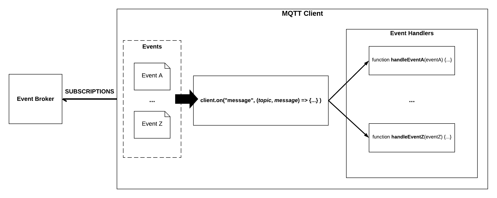

# "Event Handler" Pattern for MQTT

If you're a developer that is tasked with building an event-driven microservice for a system that uses a publish/subscribe messaging pattern, you will need to manage topic subscriptions, topic dispatch, and callbacks.

Specifically, you will need to:

1. Subscribe your microservice's messaging client to a list of topics so that it will receive relevant message flows,
2. Configure your microservice's messaging client to trigger certain functions for certain types of incoming messages
3. Configure your microservice's messaging client to respond to client events (e.g. connection acknowledgement events)

## Purpose of this repository

If you're a developer that is primarily used to working with RESTful APIs, these are probably not things you're used to doing.

If you don't have a mentor to walk you through the basics of event-driven architecture, the verbage of a lot of the documentation for these messaging clients is pretty inaccessible. A lot of the examples provided by sites, like [Eclipse Paho](https://www.eclipse.org/paho/clients/js/), are written using callbacks that make it really hard to reason about the client's flow control.

What I've tried to provide in this repository is a replicable example of a Node.js event-driven microservice that uses [MQTT.js](https://github.com/mqttjs/MQTT.js). This example microservice includes a wrapper around an MQTT client that provides an easy to reason about abstraction for handling topic subscriptions and event dispatch, similar to what Spring Cloud Stream provides for event-driven microservices in Spring apps.

If you're used to working with AWS Lambda, you should be comfortable with this pattern. Think of the event-handlers as being individual Lambdas, and the MQTT client as being a mini API gateway of sorts that triggers Lambdas and forwards on events.

## Design

This clean separation between events, event handlers, and our MQTT client lets us write modular code that is readable by programmers who are not used to messaging!
